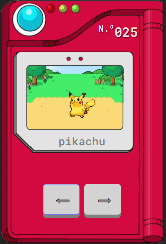

# Pokédex con React y Vite

Este es un proyecto de Pokédex hecho con React y Vite. El objetivo de esta aplicación es mostrar un Pokémon animado con su número, y permitir al usuario cambiar de Pokémon con los botones de derecha e izquierda.



## Enlaces

- [Pokédex React Vite Demo](https://illustrious-zabaione-dd754e.netlify.app/)
- [API utilizada](https://pokeapi.co/)

## Características

- Utiliza React y Vite como herramientas principales
- Utiliza el hook `useState` y el hook `useEffect` de React para manejar el estado de la aplicación
- Utiliza una API de terceros para obtener la información y la imagen del Pokémon

## Cómo usar

Para usar esta aplicación, necesitas tener Node.js instalado en tu computadora. A continuación, sigue los siguientes pasos:

1. Clona este repositorio en tu computadora:
 ```git clone https://github.com/gabrieldiazv/pokedex-react.git```

2. Instala las dependencias del proyecto:
 ```npm install```


4. Abre el navegador y ve a `http://127.0.0.1:5173/` para ver la aplicación.

5. Usa los botones de izquierda y derecha para cambiar entre los diferentes Pokémon.
